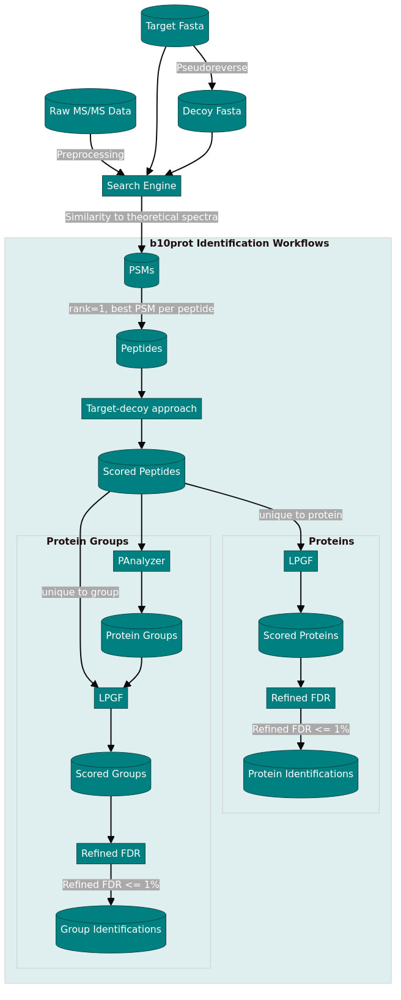

```{r eval=FALSE, include=FALSE}
pagedown::chrome_print("Poster-C0235.Rmd")
```


```{r, include=FALSE}
knitr::opts_chunk$set(echo = FALSE,
                      warning = FALSE,
                      tidy = FALSE,
                      message = FALSE,
                      fig.align = 'center',
                      out.width = "100%")
options(knitr.table.format = "html") 

library(tidyverse)
library(b10prot)

DATA_PATH <- "/home/gorka/MyProjects/EhuBio/Projects/R/b10prot/data-dev/"
GROUPS_PATH <- paste0(DATA_PATH, "groups.RData")
FDR_PATH <- "fdr_counts.RData"
```

# Motivation

- **Shotgun proteomics**: Preferred method for large-scale protein identification.
- **Challenge**: Need for robust statistical methods to automate identification and reduce false positives.
- **Our contribution**:
    - Adapted our existing protein inference and scoring tools (PAnalyzer, LPGF, refined FDR).
    - Integrated seamlessly with shotgun proteomics workflows using R.
- **Goal**: Make these tools more accessible to a wider scientific audience via R.

# Approach

## PSMs

- A `data.frame` with the following columns:
    - `psmScore`, `rank`, `isDecoy`, `peptideRef`, `proteinRef`, `geneRef` (optional)
- Select `rank=1` PSMs

## Peptides

- Best PSM per peptide as `pepScore`
- Target-decoy approach [@elias2007] to assign statistical significance [@kall2008]:
    - p-value, FDR, q-value
- Identified peptides: q-value <= 1%
- For upper level (eg. protein) scores we will use:
    - Peptide-level `LP` = cologaritm of p-value

## Proteins/Genes

- Consider only peptides **unique** to one protein/gene
- Calculate **LPGF** score [@prieto2020] from:
    - `LP` peptide scores
    - `n` number of matched peptides
    - `m` number of identified peptides
- Protein/Gene-level **refined FDR** [@prieto2020] using LPGF score

## Protein Groups

- Construct protein groups using **PAnalyzer** [@prieto2012]
- Consider only peptides **unique** to one group
- Calculate group-level **LPGF** score
- **Group-level FDR** using LPGF score

{width=100%}

# Results

- New **b10prot** R package: https://akrogp.github.io/b10prot/

- **PAnalyzer** can now be used from R:

```{r}
data(example_panalyzer, package = "b10prot")
plot_groups(example_panalyzer, groupRefs = 1:5)
```

- **LPGF** and **FDRr** implemented in R:

```{r echo=FALSE}
load(GROUPS_PATH)

groups %>% 
    plot_rank()
```

- Approx. 3% improvement using protein groups:

```{r echo=FALSE, fig.width=9, fig.height=3.5}
load(FDR_PATH)

fdr_counts %>% 
    ggplot(aes(x=qval*100, y=n, color=grouping)) +
    geom_line() +
    geom_vline(xintercept = 1, linetype = "dashed") +
    facet_wrap(vars(tissue), scales = "free_y") +
    ylab("Identification count") +
    xlab("FDR (%)") +
    labs(color = "Peptide Assignment") +
    theme(legend.position = "bottom")
```


- Approx. 5% improvement compared to other scores:
    - @pedro2024

# References
