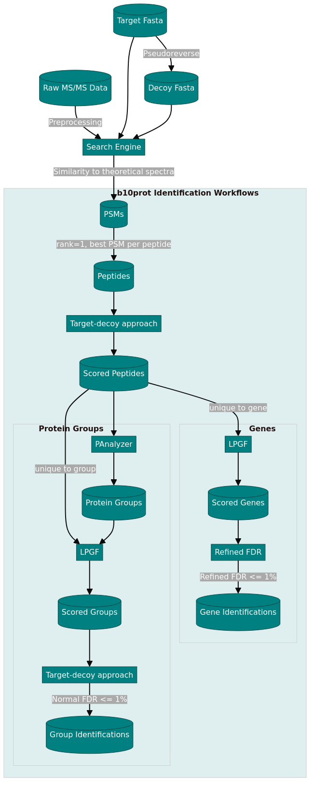

```{r eval=FALSE, include=FALSE}
pagedown::chrome_print("Poster-C0235.Rmd")
```


```{r, include=FALSE}
knitr::opts_chunk$set(echo = FALSE,
                      warning = FALSE,
                      tidy = FALSE,
                      message = FALSE,
                      fig.align = 'center',
                      out.width = "100%")
options(knitr.table.format = "html") 

library(DiagrammeR)
```

# Motivation

- **Shotgun proteomics**: Preferred method for large-scale protein identification.
- **Challenge**: Need for robust statistical methods to automate identification and reduce false positives.
- **Our contribution**:
    - Adapted our existing protein inference and scoring tools (PAnalyzer, LPGF, FDRr).
    - Integrated seamlessly with shotgun proteomics workflows using R.
- **Goal**: Make these tools more accessible to a wider scientific audience via R.

```{r, include=FALSE}
knitr::write_bib(c('posterdown', 'rmarkdown','pagedown'), 'packages.bib')
```

# Approach

{width=100%}


I will show here how to include poster elements that may be useful, such as an equation using mathjax:

$$
E = mc^2
$$

To reference a citation you can add your `.bib` file to the working directory and name it in the YAML metadata or generate an automated one as done here, then you only need to reference the label value in the `.bib` file. For example this package is built on top of the wonderful {pagedown} package and I will cite it at the end of this sentance using this in the rmd `[@R-pagedown]` [@R-pagedown].

To get a better understanding of how to include features like these please refer to the {posterdown} [wiki](https://github.com/posterdown/wiki).

**_Now on to the results!_**

# Results

Here you may have some figures to show off, bellow I have made a scatterplot with the infamous Iris dataset and I can even reference to the figure automatically like this, `Figure \@ref(fig:irisfigure)`, Figure \@ref(fig:irisfigure).

```{r, irisfigure, fig.cap='Here is a caption for the figure. This can be added by using the "fig.cap" option in the r code chunk options, see this [link](https://yihui.name/knitr/options/#plots) from the legend himself, [Yihui Xie](https://twitter.com/xieyihui).', out.width="80%"}
par(mar=c(2,2,0,1))
plot(x = iris$Sepal.Length, y = iris$Sepal.Width,
     col = iris$Species, pch = 19, xlab = "Sepal Length",
     ylab = "Sepal Width")
```

Maybe you want to show off some of that fancy code you spent so much time on to make that figure, well you can do that too! Just use the `echo=TRUE` option in the r code chunk options, Figure \@ref(fig:myprettycode)!

```{r myprettycode, echo=TRUE, fig.cap='Boxplots, so hot right now!', fig.height=6, out.width="80%"}
#trim whitespace
par(mar=c(2,2,0,0))
#plot boxplots
boxplot(iris$Sepal.Width~iris$Species,
        col = "#008080", 
        border = "#0b4545",
        ylab = "Sepal Width (cm)",
        xlab = "Species")
```

How about a neat table of data? See, Table \@ref(tab:iristable):

```{r, iristable}
knitr::kable(
  iris[1:15,1:5], format = "html",
  caption = "A table made with the **knitr::kable** function.",
  align = "c", col.names = c("Sepal <br> Length",
                             "Sepal <br> Width",
                             "Petal <br> Length",
                             "Petal <br> Width",
                             "Species"),
  escape = FALSE)
```

# References
